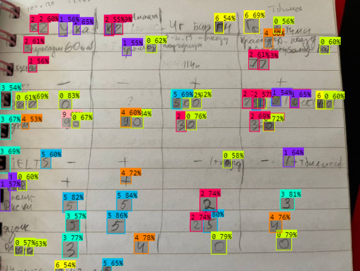

# Handwritten Digits Recognition Telegram Bot

This is a Telegram bot that recognizes handwritten digits from an image sent to it and returns the original image with bounding boxes and labels around each detected digit.


## Example




## Installation

1. Clone the repository:

    ```
    git clone https://github.com/Ceasari/OD_bot/
    ```

2. Install the required libraries:

    ```
    pip install -r requirements.txt
    ```

3. Download the pre-trained model by [link](https://drive.google.com/drive/folders/17ha83DuhPzufn5oN54mMY3WVq3UW3u47?usp=sharing) 


There are two pre-trained model: 
      
* YOLOv8_l trained based on large model of YOLOv8l
      
* YOLOv8_x trained based on large model of YOLOv8x

4. Save the downloaded model to the [Model](Model)
   
5. Insert telegram API key and path to downloaded model to `config.py`

6. Run `main.py`

## Usage

1. Start a chat with the bot by searching for `@bot_name`.
2. Send the bot a photo with handwritten digits.
3. Wait for the bot to process the image and return the original image with bounding boxes and labels of each detected digit.

## License

This project is licensed under the MIT License - see the [LICENSE](LICENSE) file for details.
